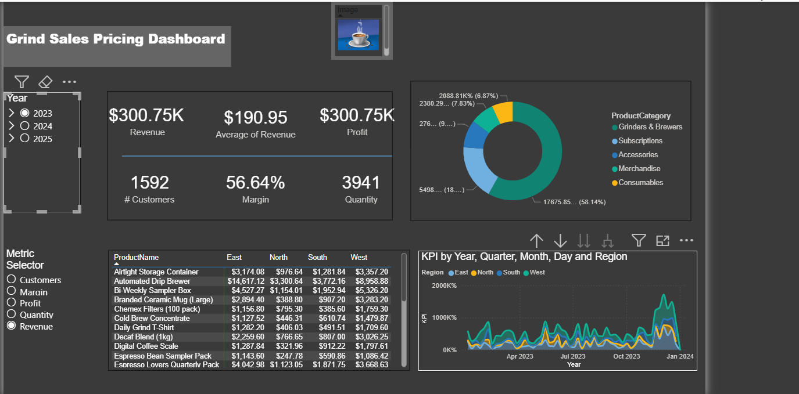

# Grind Sales Data Analysis (SQL + Power BI)

## Project Overview

This project analyzes sales performance data for a fictional coffee shop called **Grind Coffee**. The goal of the project is to transform raw sales data into meaningful business insights using **SQL for data analysis** and **Power BI for data visualization**.

The analysis focuses on understanding sales trends, customer behavior, and product performance in order to support better business decision-making.

---

## Business Problem

Retail businesses need to understand their sales performance to optimize operations and increase revenue. However, raw sales data alone does not provide clear insights.

This project answers key business questions such as:

* Which products generate the most revenue?
* Which months have the highest sales?
* Who are the most valuable customers?
* How do sales change over time?

---

## Tools & Technologies

* **SQL** – Data exploration and business analysis
* **Power BI** – Dashboard and visual analytics
* **CSV Dataset** – Raw sales and customer data
* **GitHub** – Version control and project documentation

---

## Project Structure

```
grind-sales-sql-powerbi
│
├── data
│   ├── Orders_2023.csv
│   ├── Orders_2024.csv
│   ├── Orders_2025.csv
│   └── customers.csv
│
├── sql
│   └── 01_Data_consolidation.sql
│
├── powerbi
│   └── grind_sales_dashboard.pbix
│
├── images
│   └── dashboard_preview.png
│
└── README.md
```

---

## Data Preparation

The dataset contains sales orders across multiple years.
The following steps were performed:

1. Combined multiple yearly order files
2. Cleaned and standardized data fields
3. Joined sales data with customer information
4. Prepared the dataset for analysis

---

## Key SQL Analysis

Using SQL, several analytical queries were created to extract business insights such as:

* Total revenue by product
* Monthly sales trends
* Customer purchase behavior
* Top performing products

Example query:

```sql
SELECT 
    product_name,
    SUM(sales_amount) AS total_sales
FROM orders
GROUP BY product_name
ORDER BY total_sales DESC;
```

---

## Power BI Dashboard

A Power BI dashboard was built to visualize key metrics and trends.

The dashboard includes:

* Total Revenue KPI
* Sales by Product
* Monthly Sales Trends
* Customer Distribution
* Top Performing Products

These visualizations help stakeholders quickly understand business performance.

---

## Key Insights

From the analysis, several important insights were identified:

**1. Seasonal Sales Trends**
Sales increase significantly during certain months, suggesting strong seasonal demand.

**2. Product Performance**
A small number of products generate the majority of revenue, highlighting key products driving sales.

**3. Customer Contribution**
A group of repeat customers contributes a large portion of total sales, indicating high customer loyalty.

**4. Growth Over Time**
Sales show a positive trend across the analyzed years, indicating business growth.

---

## Dashboard Preview

[](images/grind_sales_dashboard.png)

## Project Goal

The goal of this project is to demonstrate practical skills in:

* SQL data analysis
* Business intelligence reporting
* Data visualization using Power BI
* Data storytelling with business insights

---

## Author

Kidus Yosef
Data Analytics Portfolio Project
